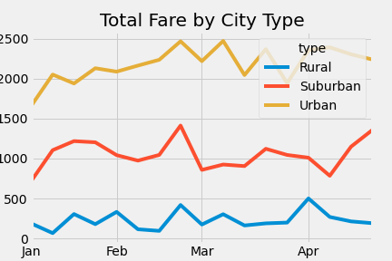

# Overview
The ride-sharing app company valued at $2.3 billion and I will help them to analyze rideshare suitation from Jan to April 2019. The analysis and visualizations I produced would help PyBer improve access to ride-sharing services and determine affordability for underservered neighboardhood. 
# Results
Overall, urban's total fare is greater than suburban's and suburban's total fare is greater than rural's from Jan to April 2019. Per the image below, the urban's total fare is around $2000-$2500 and rural's total fare is around $0-$500. We can say urban's total fare is around 5 times compared with rural's total fare.
To be specific, urban's total rides, total drivers, and total fares are far larger compared with the suburban and rural's, but average fare/ride and average fare/driver is much lower than the suburban and rural's

# Summary
Based on the results, three business recommendations to the CEO for addressing any disparities among the city types:
-Since urban is the largest market, improving urban's drivers benefits and fares is very significant.
-Create a benefit program for the drivers who would like to across city to drive, so more fexible ervice will get more business.
-Rural has less business, but fare/ride is high, we can provide more coupon to the customers to let them use our service frequently.
